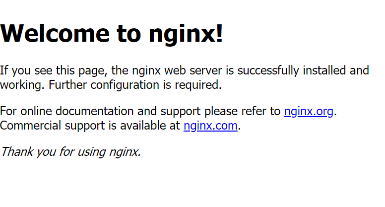

## 1. 필요 모듈 설치
```
./auto.sh
```

## 2. mysql 비밀번호 설정

## 3. nginx 확인

일단 홈페이지에 자신의 ip주소를 적어본다.





위 홈페이지가 나올경우 올바르게 작동하는 것이다.

```
Client <-> Nginx(Server)
```


## 4. uwsgi 설정

### uwsgi_params 복사

```
cp /etc/nginx/uwsgi_params /Capstone_Design/src/Django/scode/
```

### configure 파일 만들기

```
vi /etc/nginx/sites-available/config.conf
```

```
# upstream(proxy) 설정
upstream django{
    #1 uWSGI를 이용한 django 서버가 listening 할 ip주소와 port 번호를 적어주시면 됩니다. upstream에 다른 외부 서버를 연결할수도 있지만 여기서는 로컬에 있는 django에 보내니 주소가 127.0.0.1이고 포트는 8001로 설정하였습니다.
    server 127.0.0.1:8001;
}

# configuration of the server
server {
    #2 django가 아니라 외부에서 어떤 port를 listening 할지 정해줍니다.
    listen      [Port Number];
    #3 실행하는 서버의 IP주소 혹은 Domain을 적어주시면 됩니다.
    #4 이 server_name을 여러개 만들어서 subdomain도 각각 다르게 처리 가능합니다.
    server_name [IP Address];
    charset     utf-8;

    # max upload size
    client_max_body_size 75M;   # adjust to taste

    #5 Django media파일 경로
    location /media  {
        alias /Capstone_Design/src/Django/scode/media;
    }

    #6 Django static파일 경로
    location /static {
        alias /Capstone_Design/src/Django/scode/static;
    }

    #7 media와 static을 제외한 모든 요청을 upstream으로 보냅니다.
    location / {
        #8 uwsgi_pass [upstream name] (위에 upstream으로 설정한 block의 이름)
        uwsgi_pass  django;
        #9 uwsgi_params의 경로
        include /Capstone_Design/src/Django/scode/uwsgi_params;
    }
}
```

**위에 port와 domain 그리고 경로 지정해주기**

### 심볼릭 링크

```
sudo ln -s /etc/nginx/sites-available/mysite_nginx.conf /etc/nginx/sites-enabled/
```

## 5. 데이터 넣기

```
sudo ./auto_setting.sh [비밀번호]
```

## 6. 서버 실행

```
vi auto_start.sh
```

안에 wsgi.py의 경로를 찾아서 적어주어야한다.

```
sudo ./auto_start.sh
```


# 참조
- [https://twpower.github.io/41-connect-nginx-uwsgi-django](https://twpower.github.io/41-connect-nginx-uwsgi-django)
